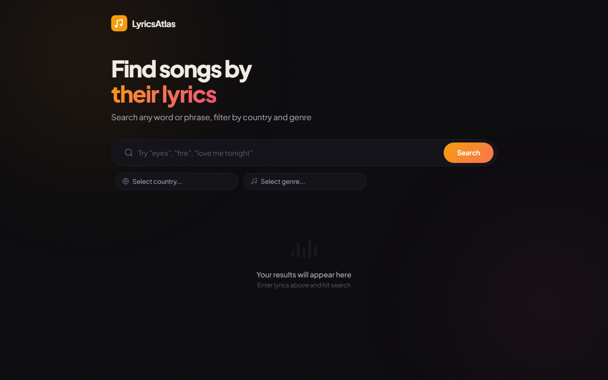

# LyricsAtlas — Discover Music Through Lyrics, From Anywhere in the World

LyricsAtlas is a web-based music discovery platform that lets you search for songs using words or phrases from their lyrics, then filter results by the artist's **country of origin** and **genre**. It bridges the gap between remembering a lyric fragment and finding the exact song — especially for music from specific regions that mainstream search engines tend to bury.



## Why LyricsAtlas?

Most music search tools are biased toward Western pop charts. If you're looking for a Nigerian song with a specific lyric, or want to explore Korean hip-hop tracks that mention a certain phrase, generic search engines won't help much. LyricsAtlas solves this by combining full-text lyrics search with geographic and genre filtering — so you can search globally and filter locally.

## Features

- **Lyrics Search** — Enter any words or phrases and find songs containing them (powered by Genius's full-text search across millions of tracks)
- **Country Filter** — Narrow results to music from a specific country (e.g. Nigeria, Ghana, Jamaica, South Korea, Japan)
- **Genre Filter** — Filter by genre tags (Afrobeat, Hip Hop, R&B, Pop, Reggae, and more)
- **Smart Result Ranking** — Results respect Genius's relevance ordering, so specific lyric phrases surface exact matches first
- **Artist Enrichment** — Country of origin and genre tags loaded automatically from MusicBrainz (free, community-driven)
- **Modern UI** — Dark theme with warm accents, responsive layout, skeleton loading, and smooth animations

## How It Works

LyricsAtlas uses a hybrid architecture combining two free APIs:

### Unfiltered Search
1. You type lyrics keywords (e.g. "Monday morning talking about me")
2. The backend queries the **Genius API** across multiple pages in parallel
3. Results are returned in relevance order — specific phrases match their exact songs first
4. In the background, each artist is looked up on **MusicBrainz** to fetch their country and genres
5. Badges (country, genre) appear on cards as the enrichment data loads

### Filtered Search (Country / Genre)
When you select a country or genre filter, the search strategy changes entirely:
1. The backend fetches the **top 100 artists** from the selected country via MusicBrainz
2. It runs **parallel Genius searches** for your lyrics combined with each country artist's name
3. Additional broad searches are run for the lyrics + country name and lyrics + genre
4. MusicBrainz recording search finds songs with matching titles from known country artists
5. All results are verified against the selected filters before being returned
6. New artist lookups are capped to keep response times reasonable

This multi-pronged approach ensures you get relevant results from specific regions, not just globally popular tracks.

## Tech Stack

| Layer    | Technology                          |
|----------|-------------------------------------|
| Backend  | Python / Flask                      |
| Search   | Genius API (free token required)    |
| Metadata | MusicBrainz API (free, no key)      |
| Frontend | HTML, CSS, vanilla JavaScript       |

## Setup

### 1. Get a Genius API Token (free)

1. Go to [genius.com/api-clients](https://genius.com/api-clients)
2. Sign in (or create a free account)
3. Click **New API Client**, fill in any app name and URL (e.g. `http://localhost`)
4. Click **Generate Access Token** and copy it

### 2. Install Dependencies

```bash
pip install -r requirements.txt
```

On Windows, if `pip` isn't on your PATH:

```bash
py -m pip install -r requirements.txt
```

### 3. Configure Environment

```bash
cp .env.example .env
```

Open `.env` and paste your Genius token:

```
GENIUS_ACCESS_TOKEN=your_actual_token_here
```

### 4. Run

```bash
python app.py
```

Or on Windows:

```bash
py app.py
```

Then open [http://localhost:5000](http://localhost:5000).

## Architecture Notes

- **Genius API** — Free tier with no hard rate limit for reasonable usage. Used for full-text lyrics search.
- **MusicBrainz API** — Completely free, no API key needed. Rate-limited to 1 request/second (enforced server-side). Artist metadata is cached in memory, so repeated searches are fast.
- **Parallel execution** — Filtered searches run multiple Genius queries concurrently using Python's `ThreadPoolExecutor` to minimize latency.
- **Caching** — In-memory caches for MusicBrainz artist lookups and country artist lists reduce redundant API calls and speed up repeat searches.

## License

MIT
